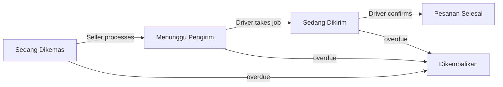

# SEAPEDIA — Product Requirements

This PRD is the authoritative specification for what SEAPEDIA must do. It is derived from the COMPFEST 18 challenge brief. Implement against this document. Concrete formulas and chosen defaults (tax base, fee tables, earning rule, SLAs) live in `knowledge.md`.

## Core Business Rules (cross-cutting)

These apply across multiple levels and must be reflected consistently in both frontend and backend.

- Four account roles: **Admin, Seller, Buyer, Driver**.
- For non-admin accounts, one username may own more than one role at the same time.
- A user with multiple non-admin roles must choose an **active role** for the current session after login.
- Authorization follows the **active role**, not merely the list of roles owned.
- Guests (no account) may browse product catalogs, product details, and public application reviews, but cannot checkout or access private dashboards.
- Guests or logged-in users may submit public application reviews without checkout or a transaction.
- Sellers must have a **unique store name**.
- Buyers must have a cart, wallet balance, delivery address, and checkout flow.
- Checkout must calculate **subtotal, discount, delivery fee, PPN 12%, and final total**.
- The discount system must support both **Vouchers** and **Promos**.
- Delivery methods must include **Instant, Next Day, and Regular**.
- Every order must store **status history with timestamps**.
- Sellers must process an order before a Driver can take the delivery job.
- Drivers must be able to find jobs, take jobs, and confirm completed jobs.
- The system must support **auto refund or auto return** for overdue orders based on delivery method.
- The system must include a way to **simulate the next day** (scheduler, cron, worker, command, or manual Admin trigger).
- Public user-generated content (application reviews, comments) must be handled safely so malicious input cannot execute on the page.

## Main Order Lifecycle

These main statuses must remain visible in the user-facing flow. Additional internal statuses are allowed but must not hide these:

1. `Sedang Dikemas` — initial status after successful checkout.
2. `Menunggu Pengirim` — after the Seller processes the order.
3. `Sedang Dikirim` — after a Driver takes the job.
4. `Pesanan Selesai` — after the Driver confirms completion.
5. `Dikembalikan` — final status for overdue auto return/refund.

Every transition records a timestamped entry in the order status history.

## Cart Behavior Rule (single-store checkout)

One cart may only contain products from **one store**. If the buyer tries to add a product from another store, the system must prevent it or clearly ask the buyer to clear the cart first. This rule must be explained in the UI, enforced consistently in the backend, and documented in the README.

---

## Level 1 — Public Marketplace, Authentication, and Reviews (20 pts)

### Public Marketplace Interface (4 pts)

Requirements:
- Landing/home page for SEAPEDIA.
- Product listing page accessible by guests.
- Read-only product detail page.
- Login page and register page.
- Dummy product data is acceptable if the product backend is not integrated yet.

Business rules:
- Guests may browse products and product details only.
- Guests must not see private dashboard actions (checkout, product management, delivery jobs).
- The public interface must communicate that SEAPEDIA is a marketplace, not a single-store catalog.

### Basic Authentication and Role Awareness (8 pts)

Requirements:
- User registration, login, and logout.
- Passwords stored securely using hashing (bcrypt).
- Token/JWT/session mechanism to authenticate requests.
- Data model supporting Admin, Seller, Buyer, Driver roles.
- One non-admin username may own multiple roles simultaneously.
- Return the list of roles owned by the logged-in user.
- Provide a way to choose the active role after login or during the session.
- Show a role selection page/modal when a user has more than one non-admin role.
- Protect private routes and API endpoints based on the active role.
- Provide an endpoint/payload returning the current logged-in user profile.
- Profile/dashboard summary page showing roles owned and the active role.
- Entry point/placeholder for balance or financial summaries across roles (real wallet/income/earnings come later).

Business rules:
- A multi-role user must not be redirected to a private dashboard before choosing an active role.
- Authorization is based on the active role, not the list of all roles owned.
- The active role must be clearly visible in the UI.
- Admin behavior may be handled separately from non-admin multi-role behavior, but documented clearly.

### Public Application Reviews (4 pts)

Requirements:
- Public review/testimonial section on the landing or another public page.
- Form to submit a review about the SEAPEDIA application/website experience.
- Form fields: reviewer name, rating 1–5, comment text.
- Display submitted reviews in a list/testimonial/carousel component.
- Usable without checkout or transaction history.
- At this level, reviews may be stored in frontend state, local storage, or a backend resource — behavior must be clear and demonstrable.

Business rules:
- Application reviews are about the website/app experience, not specific products or orders.
- Guests may submit reviews unless the implementation explicitly requires login (with a stated reason).
- Comments render as normal text and must not break layout. Formal XSS prevention is assessed in Level 7.

### Reusable UI Foundations (4 pts)

Requirements:
- Reusable components: Button, Input, Card, Navbar/Top Bar, Footer/Bottom Navigation.
- Routing structure supporting public pages and private dashboard pages.
- Dashboard shells/placeholders for Admin, Seller, Buyer, Driver.
- Responsive navigation for desktop and mobile.
- Clear difference between guest navigation and logged-in navigation.

---

## Level 2 — Building the Seller Experience (15 pts)

### Seller Store Management (5 pts)

Requirements:
- Data model/resource for Seller stores.
- Form for Sellers to create or update their store profile, including a store name field.
- Validate and show an error if the store name is already used.
- Public store summary endpoint or display block.

Business rules:
- Store names must be unique (enforced via DB constraint, backend validation, or both).
- A Seller may only manage their own store.

### Product Management for Sellers (6 pts)

Requirements:
- Product data with fields: name, description, price, stock, store owner.
- Seller endpoints + UI to create, update, and delete products.
- Seller dashboard page listing products owned by the logged-in Seller.

Business rules:
- A Seller may only create products under their own store.
- A Seller may only update/delete products that belong to them.
- Product stock must be stored (used during checkout later).

### Connect Products to the Public Catalog (4 pts)

Requirements:
- Public endpoint for listing products.
- Public endpoint for viewing product details.
- Display store information in the product listing or detail page.
- Store detail page or at least a store information block inside product details.

Business rules:
- Guests may view catalog and product details without logging in.
- Guests cannot create, update, delete, or checkout products.

---

## Level 3 — Buyer Wallet, Cart, and Checkout (20 pts)

### Buyer Wallet and Address Management (5 pts)

Requirements:
- Buyer wallet/balance resource.
- Dummy top-up flow for Buyers.
- Store and display wallet transaction history.
- Delivery address management for Buyers.
- Display Buyer balance and top-up history in the Buyer dashboard.

Business rules:
- Only users with the active Buyer role may access Buyer wallet and address features.
- The Buyer wallet must be usable by the checkout flow.

### Cart Management (5 pts)

Requirements:
- Add products to cart, update quantities, remove products.
- Cart summary endpoint and cart summary UI.
- Single-store checkout: one cart can only contain products from one store.

Business rules:
- The cart must reject products from a different store or clearly handle the conflict before adding them.
- Single-store behavior must be visible in the UI and documented in the README.

### Checkout and Basic Orders (10 pts)

Requirements:
- Checkout/create order endpoint.
- Support delivery methods: Instant, Next Day, Regular.
- Calculate subtotal, delivery fee, PPN 12%, and final total.
- Display the checkout summary in the UI before confirmation.
- Create an order following single-store checkout behavior.
- Reduce product stock safely after a successful checkout.
- Order history and order detail views for Buyers.
- Incoming order list for Sellers.
- Store order status history with timestamps.

Business rules:
- Buyers cannot checkout if wallet balance is insufficient.
- Delivery fee differs by delivery method.
- PPN shown as 12% in the checkout summary (tax-base specifics documented in `knowledge.md` and README).
- After successful checkout, the initial order status must be `Sedang Dikemas`.
- Stock reduction must not allow negative stock.

---

## Level 4 — Discounts and Seller Order Processing (15 pts)

### Voucher and Promo Discounts (6 pts)

Voucher/Promo codes may be prepared via seed data, API documentation, or a minimal Admin-only setup flow at this level (full Admin UI is Level 6).

Requirements:
- Voucher resource and Promo resource.
- Admin endpoints to generate vouchers and promos.
- Endpoints to list and view details of vouchers and promos.
- Vouchers have an expiry date and remaining usage.
- Promos have an expiry date.
- Checkout can receive a discount code, validated during checkout.
- Show the discount effect in the checkout summary.
- Keep subtotal, discount, delivery fee, PPN 12%, and final total visible.

Business rules:
- Expired Vouchers/Promos cannot be used.
- Vouchers with no remaining usage cannot be used.
- Whether Voucher and Promo can be combined is a documented, consistent decision (see `knowledge.md`).
- Voucher and Promo must be clearly distinguished in the validation result/checkout summary.
- The position of discount calculation relative to PPN 12% must be consistent and documented.

### Seller Order Processing (4 pts)

Requirements:
- Seller action to process an incoming order.
- Move status from `Sedang Dikemas` to `Menunggu Pengirim` after processing.
- Store the change in status history with a timestamp.
- Show order timeline/status tracker on both Buyer and Seller pages.

Business rules:
- Only the Seller who owns the order may process it.
- An order cannot become available to Drivers before the Seller processes it.
- Main order statuses must remain visible in the UI.

### Buyer and Seller Reports (5 pts)

Requirements:
- Buyer spending/expense summary.
- Seller income/revenue summary.
- Buyer order history, order detail, and status history with timestamps.
- Seller incoming orders, processed orders, and income summary.
- Discount, delivery fee, PPN 12%, and final total visible in transaction details.

---

## Level 5 — Delivery and Driver Workflow (10 pts)

### Delivery Jobs for Drivers (4 pts)

Requirements:
- Delivery/delivery job resource.
- Driver endpoint + UI to find available jobs.
- Driver endpoint + UI to view job details.
- Only show jobs ready to be taken.

Business rules:
- Drivers may only take jobs with status `Menunggu Pengirim`.
- Drivers must not see or take orders still `Sedang Dikemas`.
- A delivery job must be connected to a specific order.

### Take Job and Delivery Completion (4 pts)

Requirements:
- Take job action for Drivers; status moves to `Sedang Dikirim`.
- Confirm completed action; status moves to `Pesanan Selesai`.
- Store every status change with a timestamp.
- Buyers and Sellers can track delivery status.

Business rules:
- One order may only have one active Driver.
- A Driver cannot take a job already taken by another Driver (prevent races).
- The order status must move through a valid lifecycle.
- Buyer and Seller tracking must show delivery progress clearly.

### Driver Earnings and Job History (2 pts)

Requirements:
- Driver dashboard displaying active job, job history, and earnings.
- Defined earning rule (from delivery fee or another documented rule — see `knowledge.md`).
- Show earning result for completed jobs.

---

## Level 6 — Admin Monitoring and Overdue Handling (10 pts)

### Admin Monitoring Dashboard (3 pts)

Requirements — monitoring data for:
- Users, stores, products, orders, vouchers/promos, delivery jobs, overdue orders.

Business rules:
- Admin pages accessible only by users with the Admin role.
- Monitoring data must be useful enough to support a full-system demo.

### Voucher and Promo Management UI (2 pts)

Requirements:
- Admin UI to generate vouchers and promos.
- Admin UI to view voucher list/detail and promo list/detail.
- Show expiry date and usage-related information where relevant.

### Overdue Auto Return or Refund (5 pts)

Requirements:
- Define delivery SLA rules for Instant, Next Day, Regular (see `knowledge.md`).
- Implement auto refund or auto return for overdue orders.
- Move overdue orders to a clear final status, at minimum `Dikembalikan`.
- Apply required financial and stock changes when refunded/returned.
- Store the overdue-related status change with a timestamp.
- Show overdue/auto-return/auto-refund results in the UI.
- Provide a way to simulate the next day / move system time forward for demo.

Business rules:
- Overdue handling must consider the selected delivery method.
- Overdue handling must be verifiable via UI, API response, or status history.
- Refund applies only to orders already successfully checked out and paid.
- Refunded amount returns to the Buyer wallet and is recorded in wallet transaction history.
- Refunded/returned orders must not count as Seller income; if income was recorded, create a reversal or clearly adjust the income report.
- Product stock is restored based on refunded/returned item quantities, unless a different rule is documented.
- Prevent double refund, double income reversal, and double stock restoration for the same order (idempotency).
- The system must not silently change orders without a visible trace.
- The final result must be clearly reflected in the order status.

---

## Level 7 — Security Hardening and Finalization (10 pts)

### Secure Inputs, Queries, and Public Comments (4 pts)

Requirements:
- Prevent SQL Injection via parameterized queries / ORM-safe APIs (Prisma).
- Prevent XSS by escaping/sanitizing user-generated content before rendering, including review comments.
- Validate required fields before saving: email, phone number, rating, quantity, price, stock, discount values.
- Reject invalid/dangerous input with clear error messages.
- Ensure public review comments cannot execute scripts or break layout.

Suggested test cases:
- A `<script>` tag in the review comment field is displayed safely or rejected.
- SQL-like payloads in login, search, review, and checkout forms do not affect DB structure or query behavior.

### Harden Session and Role-Based Access Control (3 pts)

Requirements:
- Logout invalidates/clears the active session or token correctly.
- Protected endpoints cannot be accessed by manually changing frontend routes.
- Active role is verified server-side for Seller, Buyer, Driver, and Admin actions.
- Users cannot access/modify resources owned by other users (another Seller's product, another Buyer's order, another Driver's job).
- Reasonable token/session expiration behavior, documented.

Business rules:
- The backend must not trust role information just because it appears in the UI.
- A multi-role user may only perform actions allowed by the currently active role.
- Admin-only endpoints and pages must not be accessible by non-admin users.

### Final Documentation and Demo Data (3 pts)

Requirements:
- API documentation (Swagger/OpenAPI, Postman, or another clear format).
- Seed data / demo accounts for Admin, Seller, Buyer, Driver.
- Document single-store checkout behavior.
- Document discount combination rule and PPN 12% calculation rule.
- Document the Driver earning rule.
- Document overdue SLA and how to simulate time.
- Document security measures (SQLi, XSS, input validation, session, RBAC).
- Short testing guide for the end-to-end demo flow.

---

## Final Demo Checklist

- Guest can browse catalog and product details.
- Guest or logged-in user can submit an application review without checkout.
- Submitted reviews display safely.
- User can register and login; multi-role user can choose an active role; dashboards protected by active role.
- Seller creates a unique-named store, manages products, and products appear in the public catalog; Seller processes orders `Sedang Dikemas` → `Menunggu Pengirim`.
- Buyer tops up, manages address and cart, checks out with a delivery method + optional Voucher/Promo; summary shows subtotal, discount, delivery fee, PPN 12%, final total; Buyer views order history, detail, and timeline.
- Driver finds, takes, and confirms jobs; views job history and earnings.
- Admin monitors users, stores, products, orders, discounts, deliveries, overdue orders; generates/views Vouchers and Promos; time simulation works; at least one auto return/refund scenario demonstrated; SQLi/XSS handled safely; RBAC enforced from the backend.

## Delivery Requirements

- Runs on any machine; README explains setup and required environment variables (including admin account creation).
- Public Git repository with step-by-step commit history (do not squash into one commit).
- API documentation included.
- Security notes in README.
- Optional public deployment link documented in README.
