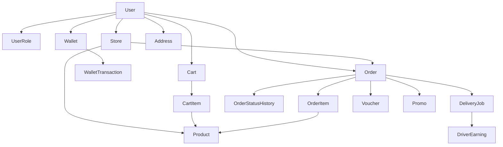

# Architecture Context

## Stack

| Layer            | Technology                       | Role                                                                 |
| ---------------- | -------------------------------- | -------------------------------------------------------------------- |
| Framework        | Next.js (App Router) + TypeScript | Full-stack app with server/client boundaries                         |
| Backend API      | Next.js Route Handlers (`app/api`) | API-based backend supporting all business flows                      |
| UI               | Tailwind + shadcn/ui             | Component composition and styling, dark + light mode                 |
| Auth             | Custom JWT/session + bcrypt      | Self-managed identity, multi-role ownership, active-role per session |
| Database         | Supabase PostgreSQL + Prisma     | Relational data for the whole marketplace                            |
| Validation       | Zod (recommended)                | Parse/validate external input at boundaries                          |
| API docs         | Swagger/OpenAPI or Postman       | Required documentation deliverable (Level 7)                         |

The backend is API-based and lives inside the same Next.js project as the frontend. There is no separate backend service.

## System Boundaries

- `app/` — Public and private pages (React Server Components by default). Route groups separate public routes from role-protected dashboards.
- `app/api/` — Route Handlers: input validation, authentication, active-role authorization, ownership checks, and persistence. This is the API-based backend.
- `lib/` — Shared infrastructure: Prisma client, auth/session helpers, password hashing, access-control guards, validation schemas, business-logic services (checkout math, discount validation, overdue handling), and utilities.
- `components/` — UI composition only. `components/ui/*` holds shadcn/ui primitives (protected); app-level components hold feature UI.
- `prisma/` — Schema, migrations, and seed script (demo accounts + voucher/promo seed data).

## Storage Model

- All marketplace data is relational and lives in **Supabase PostgreSQL**, accessed through **Prisma**.
- Connection is configured via `DATABASE_URL` (pooled) and `DIRECT_URL` (direct, for migrations) in environment variables.
- No external blob/object storage layer is required at this stage. Product imagery, if any, can use static/dummy assets or URLs.
- Money is stored in a precise form (integer minor units or `Decimal`) — never floating point — to keep wallet, checkout, and refund math exact. See `knowledge.md`.

## Data Model (high level)

Core entities and key relationships. Field-level details are defined when each level is implemented; this is the architectural shape.

- **User** — credentials (hashed password), profile. Owns one or more roles.
- **Role / UserRole** — Buyer, Seller, Driver, Admin. A non-admin user may own multiple roles. The active role is tracked per session, not on the user record.
- **Session/Token** — JWT or session reference carrying the user identity and the chosen active role.
- **Store** — belongs to a Seller (one store per Seller). Unique `name`.
- **Product** — belongs to a Store. Has price, stock, description.
- **Address** — belongs to a Buyer.
- **Wallet** — belongs to a Buyer. Has balance.
- **WalletTransaction** — top-up, checkout charge, refund. Append-only ledger linked to the Wallet.
- **Cart / CartItem** — belongs to a Buyer; constrained to a single Store (single-store checkout).
- **Order / OrderItem** — created at checkout. Stores subtotal, discount, delivery fee, PPN, final total, delivery method, and current status.
- **OrderStatusHistory** — timestamped entries for every status transition.
- **Voucher** — code, expiry date, remaining usage, discount rule.
- **Promo** — code, expiry date, discount rule.
- **DeliveryJob** — connected to a specific Order; tracks the assigned Driver and job state.
- **DriverEarning** — earning recorded per completed job.
- **ApplicationReview** — public website/experience review (name, rating 1–5, comment). Backend resource.
- **SystemClock** — single record holding the simulated "current date" used for overdue evaluation (time simulation).

## Auth and Role Model

- Identity is self-managed: users are rows in our PostgreSQL DB; passwords are hashed with bcrypt.
- A request is authenticated via JWT/session. The token/session carries both the user identity and the **active role** selected for the session.
- After login, if a non-admin user owns more than one role, they must choose an active role before reaching any private dashboard.
- Authorization is enforced **server-side** on every protected Route Handler based on the **active role**, not the full list of roles owned.
- Ownership is verified at every mutation boundary: a Seller may only touch their own store/products/orders; a Buyer only their own cart/wallet/orders; a Driver only jobs they have taken.
- Admin is privileged and handled separately from non-admin multi-role behavior. Admin accounts are created via seed data / documented setup.

## Time Simulation Model

- Overdue handling depends on elapsed time relative to a delivery SLA per method.
- A controllable system clock (`SystemClock` record) represents "now" for overdue evaluation, so the demo does not depend on real wall-clock time.
- An Admin-triggered action (and/or command/worker) advances the simulated date ("simulate next day") and runs the overdue evaluation: eligible orders are auto returned/refunded, wallet is credited, stock restored, Seller income reversed, and a timestamped status change to `Dikembalikan` is recorded.
- Overdue processing must be idempotent — re-running it must not cause double refund, double reversal, or double stock restoration.

## Invariants

1. The backend never trusts role information from the UI; the active role is verified server-side on every protected action.
2. Authorization follows the **active role** of the session, not the set of roles owned.
3. Auth and resource ownership are enforced at every mutation boundary in `app/api/`.
4. One cart contains products from a single store only (single-store checkout), enforced in the backend.
5. Stock never goes negative; stock reduction at checkout and restoration on return are safe and consistent.
6. Wallet balance changes always produce a matching `WalletTransaction` ledger entry.
7. Every order status change writes a timestamped `OrderStatusHistory` entry; orders never change silently.
8. The five main lifecycle statuses remain visible in the user-facing flow.
9. Overdue refund/return is idempotent (no double refund / reversal / restock).
10. Money is computed and stored with exact precision (no floating-point currency math).
11. Route handlers stay thin; validation and business logic live in `lib/`.
12. Client components are used only where browser interactivity or client state requires them.
